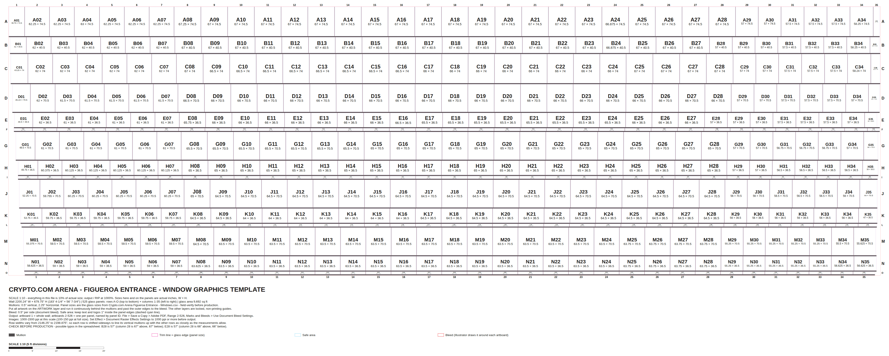

# Crypto.com Arena – Figueroa Entrance · Window Graphics Template

Editable Adobe Illustrator template for large-format window graphics, built from
[`Crypto.com Arena Figueroa Entrance - Windows.csv`](../Crypto.com%20Arena%20Figueroa%20Entrance%20-%20Windows.csv):
525 glass panels (15 rows × 35 columns), 0.5" vertical mullions, 2.25" horizontal mullions.



| File | What it is |
|---|---|
| **`Figueroa-Windows-Template.jsx`** | Illustrator script that builds the full layered template. **Use this one.** |
| `Figueroa-Windows-Template-1to10.svg` | The same drawing as a file Illustrator opens directly (no layers or per-panel artboards) |
| `Figueroa-Windows-Panel-Schedule.csv` | All 525 panels: ID, size, size + bleed, sq ft, artboard #, position, verification flags |
| `preview.png`, `preview-detail.png` | Previews |
| `tools/` | Rebuild from the spreadsheet and verify (Node.js; not needed to use the template) |

## Build the template in Illustrator

1. **File › Scripts › Other Script…** (Ctrl/Cmd+F12) and choose `Figueroa-Windows-Template.jsx`.
2. Give it a minute or two: it draws about 2,300 objects and 526 artboards.
3. **File › Save As › Adobe Illustrator (.ai).**

Needs Illustrator CC 2018 or later for the per-panel artboards. Older versions get the
elevation only.

## What's in the document

- **Scale 1:10.** Everything is 10% of actual size, so output/RIP at **1000%**. The wall is
  2200.24" × 679.75" actual (183' 4-1/4" × 56' 7-3/4"), which is 220.02" × 67.98" in the
  file. At full size it would exceed Illustrator's 227" canvas.
- **CMYK**, ruler units in inches.
- **Artboard 1, "Elevation":** the whole wall. Design here.
- **Artboards 2–526:** one per panel, sitting exactly on its trim line and named by panel ID
  (`A01` … `O35`).
- **Document bleed 0.5" actual** (0.05" in the file). Illustrator shows it as the red line
  around each artboard.
- **Panel IDs:** row letter + column number. Row A is the top row of the spreadsheet, and
  columns are numbered 1–35 left to right as in the spreadsheet.

| Layer (top → bottom) | Contents | State |
|---|---|---|
| INFO | Row/column keys, title block, legend, scale bar (below the wall) | locked, non-printing |
| LABELS | Panel ID + size (W × H, actual inches) centered in every panel | locked, non-printing |
| SAFE AREA | Dashed cyan line 1" inside every panel (keep text and logos inside it) | locked, non-printing |
| TRIM | Magenta outline of every panel = glass size | locked, non-printing |
| MULLIONS | Gray bars: 0.5" vertical, 2.25" horizontal | locked, non-printing |
| **ARTWORK** | **Your design** | unlocked, printing |

The template colors are global swatches (`Template - Mullion`, `Template - Trim`, …).
Edit one to recolor it everywhere, for example to set the mullions to the actual frame
finish for a client mockup.

## Designing

- Put everything on **ARTWORK**. Run the art continuously behind the mullions and past the
  outer edges to the bleed, so every panel crops cleanly.
- Toggle **MULLIONS** and **LABELS** to check that no faces, text or logos fall behind a
  mullion. The 2.25" horizontal bars are the ones to watch.
- Raster images need **1000–1500 ppi at this scale** (100–150 ppi at full size). Before
  output, set **Effect › Document Raster Effects Settings** to at least 1000 ppi.

## Output

**File › Save a Copy › Adobe PDF**, **Range: 2-526**, and under **Marks and Bleeds** tick
**Use Document Bleed Settings**. You get one page per panel, with bleed, in the same order
as the panel schedule (page 1 = A01, page 2 = A02, …; page = artboard # − 1). RIP each page
at 1000%. The template layers are non-printing, so mullions, labels and guides don't
output.

## How the rows are laid out

The rows are not all the same width: 2198.875" at the top (row A) and 2146.25" at the bottom
(row O). Each column gets 1.5–4.25" narrower from the top row to the bottom row. If every row
started at the same x, the vertical mullions would zig-zag. So the script shifts each row
sideways to line its vertical mullions up with the other rows as closely as the measurements
allow (a least-squares fit).

The result is a fan. The mullion after column 17 moves by less than 4" over the full
height, and the mullions move inward toward the bottom by up to 51–58" at the ends. That suggests the real
wall curves or leans and the glass is slightly trapezoidal. Each panel is still drawn as a
rectangle at its measured size. To align rows differently, set `rowAlignment` in the
script's SETTINGS to `'left'`, `'center'` or `'right'`.

Other choices, each a one-line setting at the top of the script:

- **Row order:** row A (the first spreadsheet row) is drawn at the top
  (`firstRowIsTop: true`). If the spreadsheet runs bottom-up, set it to `false`.
- **Bottom mullion:** the spreadsheet ends with a 2.25" mullion row below row O. It's
  included as a sill, which is why the height is 679.75" rather than 677.5".
- **Edge panels:** columns 1 and 35 change size a lot row to row (39.75"→56.75" and
  16"→55"), so they're probably raked or trapezoidal in reality. Template or field-verify
  them.

## Check before production

The script also flags these in the title block, the completion message and the schedule's
**Check** column.

| Panel | Spreadsheet | Why |
|---|---|---|
| **B28** | 57" × 40.5" | Column 28 is 67" in the rows above and below. The block of 57" panels starts one column early in this row. Likely a typo for 67". |
| **E28** | 57" × 36.5" | Same pattern: column 28 is 66" above and below. With 66", row E's total width fits between its neighbours. |
| D01 | 45.24" | Probably 45.25" (not a 1/8" increment) |
| C34 | 58.24" | Probably 58.25" |
| J02 | 59.755" | Probably 59.75" |

Row H (spreadsheet line 16) writes its sizes without the "x" (`60.375" 36.5"`). They were
read as W × H.

## Changing sizes or settings

- **SETTINGS** at the top of the `.jsx` covers scale, mullion sizes, bleed, safe margin,
  row alignment, row order and per-panel artboards. Edit, save, and run the script again.
- **Correct a panel size** in the spreadsheet, then run `node tools/build.mjs`. This
  rewrites the DATA block in the script and regenerates the SVG and schedule. Or edit the
  number directly in the script's DATA block and re-run it in Illustrator.

## Using the SVG instead

**File › Open** the SVG in Illustrator. You get one artboard covering the whole sheet. The
template comes in as named groups (INFO, LABELS, SAFE_AREA, TRIM, MULLIONS, BLEED), all on
one unlocked layer. Lock that layer, turn off *Print* in Layer Options, and design on a new
layer underneath. There are no per-panel artboards or document bleed, so crop panels
yourself for output.

## Tools

```sh
node tools/build.mjs ["path/to/spreadsheet.csv"]            # spreadsheet -> script DATA, SVG, schedule
NODE_PATH="$(npm root -g)" node tools/check.mjs              # verify (ESLint optional, for the ES3 check)
NODE_PATH="$(npm root -g)" node tools/render-preview.mjs     # previews (needs Playwright)
```

`check.mjs` runs the Illustrator script in an ES3 sandbox (ExtendScript's JavaScript
version) against `tools/illustrator-mock.mjs`, a strict stand-in for Illustrator's
scripting API. The mock rejects any property or method the script uses that isn't part of
the modelled API. The checks cover:

- every panel's size;
- the 0.5" and 2.25" gaps, and mullions filling them exactly;
- labels fitting inside their panels;
- per-panel artboards on the trim lines;
- layer states;
- everything on the canvas;
- the fallbacks (missing fonts, older Illustrator, no bleed support).

The SVG is rendered from that same run. None of this runs Illustrator itself. If the script
stops with an error in your version, the message names the line.
